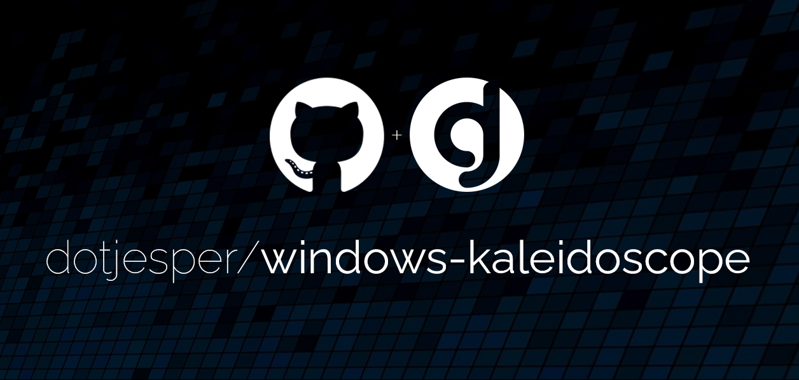

# Windows **kaleidoscope**

[](https://windows.com/ "Built for Windows 11")
[](https://windows.com/ "Built for Windows 10")
[](https://learn.microsoft.com/autopilot/overview/ "Windows Autopilot")

[](https://learn.microsoft.com/powershell/module/psscriptanalyzer/ "PowerShell Script Analyzer")
[](https://learn.microsoft.com/powershell/module/microsoft.powershell.core/about/about_language_modes/ "PowerShell Language mode")

This repository contains the source code for **Windows kaleidoscope**.


This repository is not just another PowerShell repository - it is also a personal learning platform for GitHub best practices, repository management, and solution design. If you have comments, ideas, or suggestions, please use the [Discussions](https://github.com/dotjesper/windows-kaleidoscope/discussions "Join the discussion") section.

## Idea

The idea behind **Windows kaleidoscope** draws from the original instrument. According to Wikipedia, a kaleidoscope is an optical instrument with two or more reflecting surfaces tilted to each other at an angle, so that one or more objects on one end of these mirrors are shown as a regular symmetrical pattern when viewed from the other end, due to repeated reflection.

> A kaleidoscope is used for observation of beautiful forms.

**Windows kaleidoscope** is exactly that - an optical instrument to observe device insights as a regular symmetrical pattern, adding beautiful forms to compliance and remediation data.

This repository is under development and actively maintained. This is a personal development - please respect the community sharing philosophy and be nice! Feel free to fork and build.

## Goal

The goal of **Windows kaleidoscope** is to host and share detection and remediation scripts used for Microsoft Intune remediations, along with pre-built compliance policies, custom compliance discovery scripts, and supporting tools for managing Windows 10/11 devices with [Microsoft Intune](https://learn.microsoft.com/mem/intune/fundamentals/what-is-intune "What is Microsoft Intune"). The repository also contains scripts used to extract Endpoint Analytics information.

The repository is organized into solution areas that cover different aspects of Microsoft Intune device management, such as compliance policies, custom compliance discovery scripts, remediation script packages, platform scripts, and supporting scripts. The solution is designed to be modular and extensible, allowing users to pick and choose the components that best fit their needs.

## What is included

The **Windows kaleidoscope** repository provides the following solution areas:

- **Compliance policies** - Pre-built Microsoft Intune compliance policy exports (JSON) covering focused areas such as antivirus, BitLocker encryption, firewall, Secure Boot, and Trusted Platform Module (TPM).
- **Custom compliance discovery scripts** - PowerShell discovery scripts paired with `settings.json` rule definitions for custom compliance scenarios such as Windows edition, encryption method, and hypervisor presence.
- **Remediation script packages** - Detection and remediation scripts organized by purpose:
    - `collect-*` packages for data collection
    - `monitor-*` packages for ongoing monitoring with remediation
    - `invoke-*` packages for one-time management actions
- **Platform scripts** - One-time execution scripts for scenarios such as [Windows Autopilot device preparation](https://learn.microsoft.com/autopilot/device-preparation/overview "Windows Autopilot device preparation overview").
- **Supporting scripts** - Utility and reporting scripts for Microsoft Graph-based remediation reporting.

## Requirements

**Windows kaleidoscope** is developed and tested for Windows 11 24H2 Pro and Enterprise 64-bit and newer and requires PowerShell 5.1.

All scripts are fully compatible with [PowerShell Constrained Language Mode](https://learn.microsoft.com/powershell/module/microsoft.powershell.core/about/about_language_modes "PowerShell Language Modes") (CLM), ensuring reliable execution in environments secured with AppLocker or Application Control for Business policies.

All scripts are verified with [PSScriptAnalyzer](https://learn.microsoft.com/powershell/module/psscriptanalyzer/ "PowerShell Script Analyzer") to ensure adherence to PowerShell best practices and coding standards.

Remediation scripts require users to hold one of the following licenses:

- Windows 10/11 Enterprise E3 or E5 (included in Microsoft 365 F3, E3, or E5)
- Windows 10/11 Education A3 or A5 (included in Microsoft 365 A3 or A5)
- Windows 10/11 Virtual Desktop Access (VDA) per user

## Repository content

The repository is organized into the following structure:

```text
 📂 windows-kaleidoscope/
  ├─ 📄 .editorconfig                        # Editor formatting rules
  ├─ 📄 .gitattributes                       # Git line ending rules
  ├─ 📄 .gitignore
  ├─ 📝 CONTRIBUTING.md
  ├─ 📄 LICENSE
  ├─ 📝 README.md
  └─ 📂 solution/                            # Production-ready deliverables
      ├─ 📝 README.md
      ├─ 📄 solution.wsb                     # Windows Sandbox configuration
      ├─ 📂 compliance-policies/
      |   ├─ 📝 README.md
      |   ├─ 📁 compliance-policies/         # Exported Microsoft Graph JSON policies
      |   └─ 📂 custom-script-packages/      # Discovery scripts + settings.json rules
      |       ├─ 📝 README.md
      |       ├─ 📁 sample/
      |       ├─ 📁 windows-config-refresh/
      |       ├─ 📁 windows-edition/
      |       ├─ 📁 windows-encryption/
      |       └─ 📁 windows-hypervisor/
      ├─ 📂 scripts-and-remediations/
      |   ├─ 📂 platform-scripts/            # One-time execution scripts
      |   |   ├─ 📝 README.md
      |   |   ├─ 📁 device-preparation/
      |   |   └─ 📁 sample-script/
      |   └─ 📂 remediations/                # Detect + remediate packages
      |       ├─ 📝 README.md
      |       ├─ 📁 collect-*/               # Detection only (data collection)
      |       ├─ 📁 invoke-*/                # Detect + remediate (one-time action)
      |       ├─ 📁 monitor-*/               # Detect + remediate (ongoing monitoring)
      |       └─ 📁 sample-script/
      └─ 📂 supporting-scripts/              # Utility and reporting scripts
          ├─ 📝 README.md
          └─ 📂 Invoke-RemediationReport/
              ├─ 📄 Invoke-RemediationReport.ps1
              └─ 📁 css/
```

## Disclaimer

This is not an official repository. **Windows kaleidoscope** is not affiliated with or endorsed by Microsoft. The names of actual companies and products mentioned herein may be the trademarks of their respective owners. All trademarks are the property of their respective companies.

## Contributing and feedback

Contributions, ideas, and feedback are welcome! Please see the [Contributing Guide](./CONTRIBUTING.md) for details on how to get involved.

- **Issues** - Report bugs or request features via [GitHub Issues](https://github.com/dotjesper/windows-kaleidoscope/issues "Report an issue").
- **Discussions** - Ask questions, share ideas, or start a conversation via [GitHub Discussions](https://github.com/dotjesper/windows-kaleidoscope/discussions "Join the discussion").
- **Pull Requests** - Fork the repository and submit a pull request with your improvements.
- **Wiki** - Testing, validation, deployment guidance, and supporting script documentation via the [Wiki](https://github.com/dotjesper/windows-kaleidoscope/wiki "Windows kaleidoscope wiki").

## Legal and licensing

**Windows kaleidoscope** is licensed under the [MIT license](./LICENSE "MIT license").

The information and data of this repository and its contents are subject to change at any time without notice to you. This repository and its contents are provided **AS IS** without warranty of any kind and should not be interpreted as an offer or commitment on the part of the author(s). The descriptions are intended as brief highlights to aid understanding, rather than as thorough coverage.

> [!CAUTION]
> - You should never assign compliance policies outside your pilot group.
> - You should never import compliance policies using automatic assignment.
> - You should never assign compliance policies without thorough testing and validation.

This project is intended to serve as a foundation or starting point and should not be considered complete. It has been made available to facilitate learning, development, and knowledge-sharing among communities. No liability is assumed for the usage or application of the settings within this project in production tenants.



[](https://bsky.app/profile/dotjesper.bsky.social/ "Follow Jesper")
[](https://x.com/dotjesper/ "Follow Jesper")
[](https://dotjesper.com/ "Explore https://dotjesper.com/")
